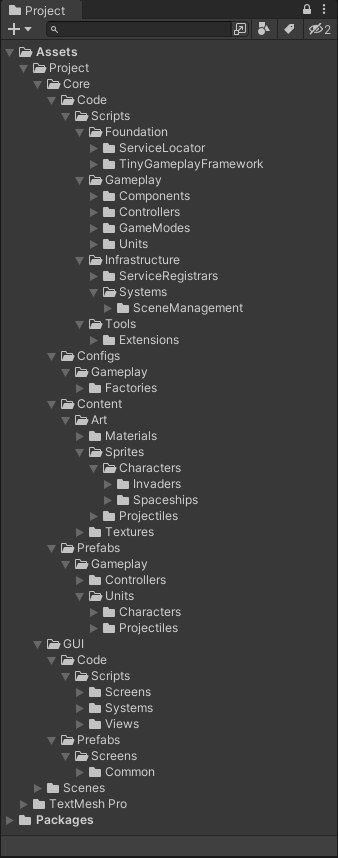
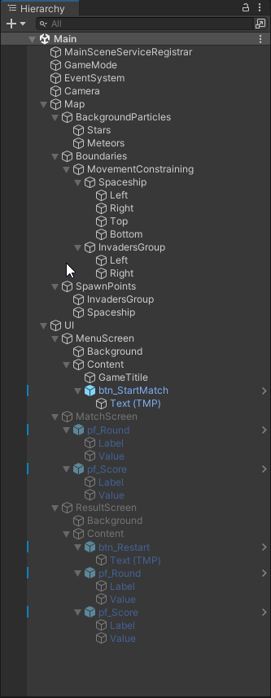

# Space Invaders game

*A game developed for a test assignment.*

## Requirements
- Develop MVP for a "Space Invaders"-like game.
- Implement horizontal and vertical movement of the spaceship.
- Implement enemy respawning and new round starting when the enemies are destroyed.
- Implement score counter for each enemy destroyed.
- Implement the ability to drop different types of projectiles from the enemies.

## Structures
| Project structure                                    | Scene structure |
|------------------------------------------------------| --------------- |
|  |  |

## Gameplay demonstration

